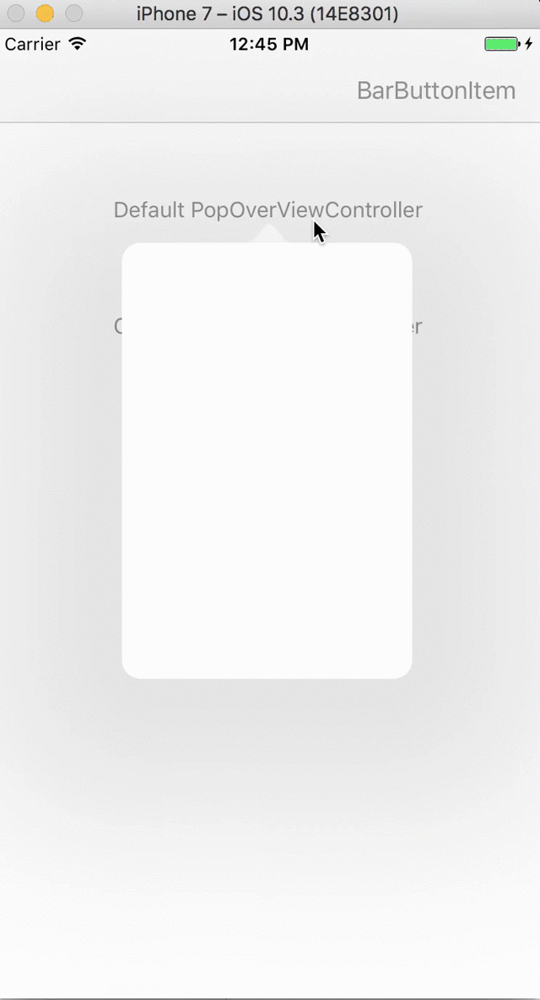

# KUIPopOver


[](http://cocoapods.org/?q=name%3AKUIPopOver%20author%3AKofktu)
[](https://github.com/Carthage/Carthage)

- Easy to use PopOver in iOS (iPhone, iPad)



## Requirements
- iOS 8.0+
- Swift 4.2
- Swift 4.0 ([1.0.4](https://github.com/Kofktu/KUIPopOver/tree/1.0.4))
- Swift 3.0 ([0.0.4](https://github.com/Kofktu/KUIPopOver/tree/0.0.4))

## Installation

#### CocoaPods
KUIPopOver is available through [CocoaPods](http://cocoapods.org). To install
it, simply add the following line to your Podfile:

```ruby
pod 'KUIPopOver'
```

#### Carthage
For iOS 8+ projects with [Carthage](https://github.com/Carthage/Carthage)

```
github "Kofktu/KUIPopOver"
```

## Usage

#### Before

```swift
let popOverViewController = DefaultPopOverViewController()
popOverViewController.preferredContentSize = CGSize(width: 200.0, height: 300.0)
popOverViewController.popoverPresentationController?.sourceView = sender

let customView = CustomPopOverView(frame: CGRect(origin: CGPoint(x: 0.0, y: 0.0), size: CGSize(width: 200.0, height: 300.0)))
popOverViewController.view.addSubview(customView)
popOverViewController.popoverPresentationController?.sourceRect = sender.bounds
present(popOverViewController, animated: true, completion: nil)
```

#### KUIPopOverUsable

```swift
public protocol KUIPopOverUsable {
    var contentSize: CGSize { get }
    var contentView: UIView { get }
    var popOverBackgroundColor: UIColor? { get }
    var arrowDirection: UIPopoverArrowDirection { get }
}

```

#### UIView

```swift
public func showPopover(sourceView: UIView, sourceRect: CGRect?, completion: ShowPopoverCompletion?)
public func showPopover(barButtonItem: UIBarButtonItem, completion: ShowPopoverCompletion?)
public func dismissPopover(animated: Bool, completion: DismissPopoverCompletion?)
```

#### UIViewController

```swift
public func showPopover(sourceView: UIView, sourceRect: CGRect?, completion: ShowPopoverCompletion?)
public func showPopoverWithNavigationController(sourceView: UIView, sourceRect: CGRect?, completion: ShowPopoverCompletion?)
public func showPopover(barButtonItem: UIBarButtonItem, completion: ShowPopoverCompletion?)
public func showPopoverWithNavigationController(barButtonItem: UIBarButtonItem, completion: ShowPopoverCompletion?)
public func dismissPopover(animated: Bool, completion: DismissPopoverCompletion?)
```

## At a Glance

#### UIView

```swift
class CustomView: UIView, KUIPopOverUsable {
    // The default size is the size of the view, and you can override it if you want to customize it.
    var contentSize: CGSize {
    	return Size
    }
}

let view = CustomView()
view.showPopover(barButtonItem: sender)
view.dismissPopover(animated: true)
view.dismissPopover(animated: true, completion: {
})
```

#### UIViewController

```swift
class CustomViewController: UIViewController, KUIPopOverUsable {
    var contentSize: CGSize {
        // PopOver preferredContentSize
    }
}

let customViewController = CustomViewController()

// from senderView
customViewController.showPopover(sourceView: sender, sourceRect: sender.bounds)

// from barButtonItem
customViewController.showPopover(barButtonItem: sender)

// with NavigationController
customViewController.showPopoverWithNavigationController(sourceView: sender, sourceRect: sender.bounds)

customViewController.dismissPopover(animated: true)
customViewController.dismissPopover(animated: true, completion: {
})
```

## Authors

Taeun Kim (kofktu), <kofktu@gmail.com>

## License

KUIPopOver is available under the ```MIT``` license. See the ```LICENSE``` file for more info.
